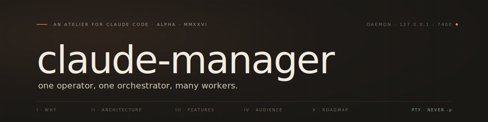

<picture>
  <source media="(prefers-color-scheme: dark)"  srcset="assets/banner-dark.svg">
  <source media="(prefers-color-scheme: light)" srcset="assets/banner-light.svg">
  
</picture>

<div align="center">

<br/>

[](#)
[](#)
[](#)
[](#)
[](./LICENSE)

</div>

<br/>

> *Command a fleet of background Claude Code workers from a single seat —
> isolated worktrees, supervised live, billed against the subscription you already have.*

<br/>

## `I` &nbsp;·&nbsp; Why this exists

The interactive `claude` CLI bills against your **Max / Pro subscription**.
The Agent SDK and `claude -p` will draw from a separate credit pool starting
**June 15, 2026**. `claude-manager` is built around a single hard constraint:

> Every Claude session is driven through an interactive PTY.
> The `-p` flag is never used. Anywhere.

The result is an orchestration layer that lets one human give a single
instruction — *"add tests to the auth module, refactor the session helper,
and update the changelog"* — and have it dispatched as three parallel
workers, each in its own git worktree, each on its own branch, supervised
live, all paid for by the subscription you already have.

<br/>

## `II` &nbsp;·&nbsp; How it works

A single daemon supervises a singleton **orchestrator** (persistent Claude
session) which dispatches **workers** via an MCP tool. Each worker owns its
own PTY-driven `claude` process inside an isolated git worktree. Everything
streams back to a SQLite event store, then out over SSE to the dashboards.

```
┌──────────────────────────────────────────────────────────────────────┐
│                                                                      │
│   user ─── one instruction ───►   TUI · Web · chat                   │
│                                       │                              │
│                                       ▼                              │
│                              ┌──────────────────┐                    │
│                              │   daemon  :7400  │                    │
│                              │   http · sse     │                    │
│                              └────────┬─────────┘                    │
│                                       │  spawns                      │
│                                       ▼                              │
│                              ┌──────────────────┐                    │
│                              │   orchestrator   │   persistent       │
│                              │   (claude · PTY) │   claude session   │
│                              └────────┬─────────┘                    │
│                                       │  mcp__orchestrator__spawn    │
│                ┌──────────────────────┼──────────────────────┐       │
│                ▼                      ▼                      ▼       │
│        ┌──────────────┐       ┌──────────────┐       ┌──────────────┐│
│        │  worker  w1  │       │  worker  w2  │       │  worker  w3  ││
│        │  worktree A  │       │  worktree B  │       │  cwd  scratch││
│        │  claude · PTY│       │  claude · PTY│       │  claude · PTY││
│        └──────┬───────┘       └──────┬───────┘       └──────┬───────┘│
│               │                      │                      │        │
│               └──────────────────────┼──────────────────────┘        │
│                                      ▼                               │
│                              ┌──────────────────┐                    │
│                              │  SQLite  ·  WAL  │   events           │
│                              │                  │   workers          │
│                              │                  │   pending perms    │
│                              └────────┬─────────┘                    │
│                                       │  sse · debounced 80 ms       │
│                                       ▼                              │
│                              TUI · Web · CLI                         │
│                                                                      │
└──────────────────────────────────────────────────────────────────────┘
```

<br/>

## `III` &nbsp;·&nbsp; Features

**Parallel orchestration.** &nbsp; A persistent orchestrator decomposes one
instruction into many. Workers run concurrently, each in its own git
worktree on its own branch. Per-worker model selection — `opus`, `sonnet`,
or `haiku`.

**Live observation.** &nbsp; SSE-driven dashboard with ~100 ms event latency.
JSONL transcripts parsed into structured tool calls, tool results, and
assistant text. Per-worker logs at `~/.claude-mgr/logs/<id>.log`.

**Human-in-the-loop policy.** &nbsp; YAML rules: `allow`, `deny`, `ask`
(long-poll for human approval), or `rewrite` (regex transform of tool
input). Pending requests surface in every interface. Full audit log at
`~/.claude-mgr/audit.jsonl`.

**Cost accounting.** &nbsp; Token usage tracked per worker, priced against
the current Anthropic rates for input, output, cache-read, and cache-create
— settled cleanly against your Max / Pro plan.

**Three interfaces, one daemon.** &nbsp; `claude-manager` CLI for scripted
use · Ink TUI for terminal-native operation · React 18 web UI served by the
daemon at `/web/`.

<br/>

## `IV` &nbsp;·&nbsp; Who it's for

|  Built for                                                                  |  Not for                                                          |
| :-------------------------------------------------------------------------- | :---------------------------------------------------------------- |
|  Solo engineers with a Claude Max / Pro plan who want real parallelism.     |  Teams looking for a hosted, multi-user platform.                 |
|  Operators comfortable with daemons, PTYs, git worktrees, and YAML policy.  |  Anyone trying to escape an interactive billing model.            |
|  Primarily macOS, secondarily Linux.                                        |  Pipelines that need headless, `-p`-style invocation.             |

<br/>

## `V` &nbsp;·&nbsp; Roadmap

- Linux-first testing and packaging.
- Worker capability hints (read-only vs. mutating) for smarter policy defaults.
- Cross-machine orchestration over the same daemon API.
- Richer cost / latency analytics in the web dashboard.

<br/>

---

<div align="center">
<sub>
<code>claude-manager</code> &nbsp;·&nbsp; <a href="./LICENSE">MIT</a> &nbsp;·&nbsp; © 2026 İbrahim Albayrak<br/>
<i>An atelier for Claude Code.</i>
</sub>
</div>
