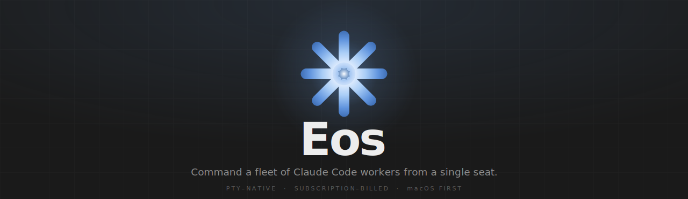
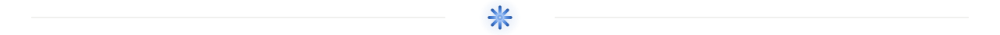

<!-- header banner: auto dark/light -->
<picture>
  <source media="(prefers-color-scheme: dark)"  srcset="assets/eos-banner-aurora-dark.svg">
  <source media="(prefers-color-scheme: light)" srcset="assets/eos-banner-aurora-light.svg">
  
</picture>

<!-- badges -->
<div align="center">


</div>

<br/>

> *One operator, an entire swarm. Eos orchestrates Claude Code agents in any structure — deep
> hierarchies, collaborating peers, wide parallel fleets — each in its own git worktree, supervised
> live, all billed against the Max / Pro subscription you already have.*

<br/>

<!-- divider -->
<picture><source media="(prefers-color-scheme: dark)" srcset="assets/eos-divider-dark.svg"></picture>

## `I` &nbsp;·&nbsp; Quickstart

One command — installs the toolchain (Node · Bun · Xcode CLT · `claude`), clones the source to
`~/eos`, builds, and launches the macOS app:

```bash
curl -fsSL https://raw.githubusercontent.com/ibrahimAlbyrk/eos/main/install.sh | bash
```

Sign in once with `claude`, and you're set. Rebuild anytime with **`eos build`**.

<details>
<summary><b>What it does · options · manual install</b></summary>

<br/>

The installer is idempotent (safe to re-run): it auto-installs anything missing, clones to `~/eos`,
installs all 8 package dirs, links `eos`, fixes your `PATH`, then runs `eos build`.

| Override | Default | Purpose |
| :------- | :------ | :------ |
| `EOS_DIR` / `--dir DIR` | `~/eos` | where the source is cloned (the compiled app points back at it) |
| `EOS_BRANCH` / `--branch B` | `main` | branch to track |
| `--no-build` | — | set up only; run `eos build` yourself afterwards |

Pass flags through the pipe with `-s --`:

```bash
curl -fsSL …/install.sh | bash -s -- --no-build
```

**Requirements** (the installer provides these) &nbsp;·&nbsp; macOS (primary; Linux secondary — no app
build) &nbsp;·&nbsp; **Node 22+** &nbsp;·&nbsp; **Bun** (permission gateway) &nbsp;·&nbsp; **git**
&nbsp;·&nbsp; the **`claude` CLI**, signed in to a Max / Pro plan &nbsp;·&nbsp; a writable `/Applications`.

**Manual, from a clone:**

```bash
git clone https://github.com/ibrahimAlbyrk/eos ~/eos && cd ~/eos
npm run bootstrap                  # install all 8 package dirs in dependency order (NOT a workspace)
bash scripts/bootstrap.sh --link   # symlink ~/.local/bin/eos  (needs ~/.local/bin on PATH)
eos build                          # compile web + macOS app, start the daemon
```

</details>

<br/>

<!-- divider -->
<picture><source media="(prefers-color-scheme: dark)" srcset="assets/eos-divider-dark.svg"></picture>

## `II` &nbsp;·&nbsp; Why this exists

The interactive `claude` CLI bills against your **Max / Pro subscription**. The Agent SDK and
`claude -p` draw from a **separate, metered credit pool**. Eos is built around one hard constraint:

> **Every Claude session is driven through an interactive PTY. The `-p` flag is never used — anywhere.**

That single rule is what makes the rest possible: you give one instruction —
*"add tests to the auth module, refactor the session helper, and update the changelog"* —
and Eos dispatches it as three parallel workers, each in its own git worktree, each on its own
branch, supervised live, **all paid for by the subscription you already have.**

<br/>

<!-- divider -->
<picture><source media="(prefers-color-scheme: dark)" srcset="assets/eos-divider-dark.svg"></picture>

## `III` &nbsp;·&nbsp; How it works

A single **daemon** supervises one or more persistent **orchestrators** (long-lived Claude
sessions). An orchestrator decomposes your instruction and spawns **workers** through an MCP tool.
Each worker drives its own PTY `claude` process inside an isolated git worktree, and may consult its
peers or spawn sub-workers of its own. Every tool call any session makes is brokered by the
**permission gateway**. State and a full event log land in SQLite (WAL), then stream out over SSE to
every interface in ~100 ms.

```
            you ─ "add tests, refactor the session helper, update the changelog"
                                       │
                     Web UI   ·   eos CLI   ·   macOS app
                                       │  http
                          ╭─────────────────────────╮       ╭─────────────────────────╮
                          │      daemon · :7400     │ ────▶ │       SQLite · WAL      │
                          │   http · sse · events   │       │      events · state     │
                          ╰────────────┬────────────╯       ╰─────────────────────────╯
                                       │  spawns a persistent PTY session
                          ╭─────────────────────────╮
                          │       orchestrator      │   decomposes one instruction
                          │       claude · PTY      │   into many workers
                          ╰────────────┬────────────╯
                                       │  spawn_worker (MCP)
                ╭──────────────────────┼──────────────────────╮
                ▼                      ▼                      ▼
         ╭─────────────╮        ╭─────────────╮        ╭─────────────╮
         │  worker w1  │        │  worker w2  │        │  worker w3  │
         │  worktree A │        │  worktree B │        │  worktree C │
         │  claude·PTY │        │  claude·PTY │        │  claude·PTY │
         ╰──────┬──────╯        ╰──────┬──────╯        ╰──────┬──────╯
                │        peers may consult one another        │
                ╰────────────── every tool call ──────────────╯
                                       │
                          ╭─────────────────────────╮
                          │      gateway · Bun      │   allow · deny ·
                          │    permission broker    │   ask (human) · rewrite
                          ╰────────────┬────────────╯
                                       │  approvals + live events  (SSE)
                     Web UI   ·   eos CLI   ·   macOS app
```

<br/>

<!-- divider -->
<picture><source media="(prefers-color-scheme: dark)" srcset="assets/eos-divider-dark.svg"></picture>

## `IV` &nbsp;·&nbsp; Features

**Parallel orchestration.** &nbsp; A persistent orchestrator turns one instruction into many. Workers
run concurrently, each in its own git worktree on its own branch, and can spawn sub-workers. Pick the
model (`opus` · `sonnet` · `haiku`) and reasoning effort per worker.

**Peer collaboration.** &nbsp; Workers launched to collaborate can consult one another directly —
`ask_peer` / `respond_to_peer` / `list_peers` — without routing every question back through the
orchestrator.

**Live observation.** &nbsp; An SSE-driven dashboard streams each session at ~100 ms latency. JSONL
transcripts are parsed into structured tool calls, results, thinking, and reports — with live tool
indicators, a thinking timer, a task tray, and a background-activity monitor. Per-worker logs at
`~/.eos/logs/<id>.log`.

**Split-screen.** &nbsp; Watch up to four agents at once instead of switching between them — the
dashboard tiles their live transcripts (2 side by side · 3 as one-plus-two · 4 as a 2×2 grid). Click
any pane to focus it; the shared header, composer, and side panel follow the focused pane, so you
steer one conversation without ever losing sight of the rest.

**In-app Git.** &nbsp; Manage branches (create · rename · delete · checkout · fetch), deterministic
**push** and fast-forward **pull** that don't spend an agent turn, diff and commit viewers, a
hunk-level **conflict resolver**, PR creation via `gh`, and a **Try** stack that applies a worker's
uncommitted changes into your own tree.

**Human-in-the-loop policy.** &nbsp; YAML rules decide every tool call: `allow`, `deny`, `ask`
(long-poll for a human, no timeout), or `rewrite` (transform the tool input). Per-worker permission
modes (`acceptEdits` · Full Access), inline approval banners, and a full audit log.

**Assembled prompts (DPI).** &nbsp; System prompts are composed per-spawn from a central prompt
library, selected by role and session context — never hardcoded. Project memory and reusable prompt
templates (with tab-stops) are first-class.

**Three ways in, one daemon.** &nbsp; A React 18 web UI, the `eos` CLI, and a native macOS app
(WKWebView) — plus a ⌘K command palette and session resume that survives daemon restarts. Token
usage is tracked and priced per worker (display-only).

<br/>

<!-- divider -->
<picture><source media="(prefers-color-scheme: dark)" srcset="assets/eos-divider-dark.svg"></picture>

## `V` &nbsp;·&nbsp; How the orchestrator prompts

**A sub-agent is only as good as its brief.** Most multi-agent systems split a task and hope; Eos's orchestrator writes each worker's prompt the way a senior engineer writes a handoff — and the craft is *encoded*, not improvised, in the prompt library at `manager/prompts/role/orchestrator/`, assembled per-spawn by DPI.

**Every worker prompt has the same shape** — the outcome first, then only the facts the worker can't cheaply discover for itself:

```
<directive — ONE outcome sentence: the result and where it lands>

Context:      environment map — paths, the pattern to match, an invariant no grep surfaces
Acceptance:   a check the worker can run or observe — plus what to do when it can't be met
Out of scope: a fence, only when wander-risk exists — each ban paired with a do-instead
Report:       the task-specific delta — the standard report wrapper is automatic
```

**It's taught by contrast.** *"improve the message queue"* becomes *"add `DELETE /workers/:id/queue` that clears all undispatched messages for one worker"*; *"make it work"* becomes *"`npm test` passes; endpoint returns `{removed:n}`; can't pattern-match a bulk delete → report `needs input:`."* Conditional add-ons fire only when their trigger does — **Read-first** when the task hinges on an existing pattern, **Honor** when a non-obvious prior decision binds the design, **Known-failure-mode** when a similar task failed a specific way before.

**Acceptance always defines its own failure.** A worker that can't clear the bar is told to report `needs input:` or `failed:` — never to fake a pass. Workers answer on a three-token protocol the orchestrator parses by the first line — `result:` / `needs input:` / `failed:` — and every worktree branch is handed back on a machine-parsed `Handover:` line whose verdict (`passed` only after the command actually ran) is held to honesty.

**Fan-out is disciplined, not eager.** The default is one worker; a wrong split bakes a bad assumption in N times. When the parts are genuinely independent, the swarm playbook runs a hard gate first — **settle the contract** (APIs, data shapes, file ownership) before any parallel work, because isolated worktrees each invent their own interface otherwise — then fans out in rounds with **disjoint ownership** so the branches merge clean, fans back in to **integrate and verify** the combined result, and **independently re-checks load-bearing claims** ("re-run the command, confirm or refute, don't edit"). For investigations the same arc becomes a research swarm: 4–8 overlapping dimensions, evidence written to files, findings tiered by cross-confirmation.

**Workers can also consult each other.** A `collaborate` swarm pairs **providers** — each the authority on one subsystem — with **consumers** that pull ground truth on demand instead of guessing, no fact routed back through the orchestrator.

<br/>

<!-- divider -->
<picture><source media="(prefers-color-scheme: dark)" srcset="assets/eos-divider-dark.svg"></picture>

## `VI` &nbsp;·&nbsp; Examples

Both were produced **one-shot — a single prompt, no follow-ups.** Eos planned the work, spun up the
agents, and delivered.

**Witherreach — a complete game design document.** &nbsp; One prompt asked Eos to invent an original
survival-RPG and write its entire GDD: spawn domain-expert agents (narrative · survival · RPG/combat ·
tech/co-op · market) whose sole job is to supply authoritative knowledge, then let the research and
writing agents consult them. In all, **12 agents** ran the document from start to finish — communicating with one another and coordinating the whole process. Out came **Witherreach** — a dark-fantasy survival-RPG where the
corruption killing the world is also your only source of power — **21 chapters, a ~64,000-word design
bible.**

> *The entire prompt (translated): "I'm going to make a survival-RPG but I have no concept — you come
> up with the idea and write the document. Write the GDD and run the whole process. Create specialised
> agents, each an expert in a different field, whose job is to supply the needed information; the
> research and writing agents can consult them. Produce an advanced, high-quality document this way."*

→ Read [`examples/WITHERREACH-GDD.md`](examples/WITHERREACH-GDD.md) — the full ~64,000-word design bible.

**An Age of Empires-style RTS — playable.** &nbsp; A single prompt produced a working Age of
Empires-style real-time strategy game, built and shipped in one pass by **39 agents working in parallel**.

→ **[▶ Play it](https://playmore.world/#game/9eb83f07-85d0-46ff-900f-30aaa446a5ae)**

<br/>

<!-- divider -->
<picture><source media="(prefers-color-scheme: dark)" srcset="assets/eos-divider-dark.svg"></picture>

## `VII` &nbsp;·&nbsp; The `eos` CLI

One daemon, one binary. `eos help` lists everything.

| Command | What it does |
| :------ | :----------- |
| `start` / `stop` / `restart` | Run, halt, or restart the daemon (`restart --db` also wipes state). |
| `build` | Converge the deploy: deps → web → macOS app → daemon. |
| `status` / `doctor` | Reachability check · environment & state sanity checks. |
| `orchestrator new` | Spawn a persistent orchestrator (`--cwd` · `--model`). |
| `chat <message>` | Send an instruction to an orchestrator. |
| `spawn` | Launch a single worker directly (`--worktree-from` · `--prompt` · `--model`). |
| `ls` · `show <id>` · `logs <id> -f` | List workers · inspect one · tail its log. |
| `kill <id>` | Terminate a worker. |
| `perm ok\|no <id>` | Approve or deny a pending permission request. |
| `config print\|init` · `prompts validate` | Dump merged config · validate the prompt library. |
| `hooks` | Install the permission-gateway hook into `~/.claude/`. |

<br/>

<!-- divider -->
<picture><source media="(prefers-color-scheme: dark)" srcset="assets/eos-divider-dark.svg"></picture>

## `VIII` &nbsp;·&nbsp; Project layout

A clean-architecture monorepo — `contracts` → `core` → `infra` → entrypoints, with the dependency
direction enforced at lint time. Each directory installs on its own; it is **not** an npm workspace.

```
contracts/   Zod schemas + types — the single source of truth for every IPC shape
core/        pure domain · ports · use-cases · services (zero Node imports)
infra/       adapters for core ports — SQLite, child_process, chokidar, …
gateway/     MCP permission broker (runs on Bun)
spawner/     worker.ts — PTY lifecycle, verified message delivery, JSONL ingest (Node only)
manager/     daemon · CLI · orchestrator/worker MCP · routes · prompt library
manager/web/ React 18 + Vite dashboard, served by the daemon
app/         native macOS WKWebView wrapper → Eos.app
```

User data lives in **`~/.eos`** — `state.db` (SQLite/WAL), `policy.yaml`, `config.json`,
`templates/`, `logs/`, and automatic startup `backups/`. It is treated as non-regenerable and is
never destroyed by tooling.

<br/>

<!-- divider -->
<picture><source media="(prefers-color-scheme: dark)" srcset="assets/eos-divider-dark.svg"></picture>

## `IX` &nbsp;·&nbsp; Who it's for

| Built for | Not for |
| :-------- | :------ |
| Solo engineers on a Claude Max / Pro plan who want real parallelism. | Teams wanting a hosted, multi-user platform. |
| Operators comfortable with daemons, PTYs, git worktrees, and YAML policy. | Anyone trying to escape an interactive billing model. |
| Primarily macOS, secondarily Linux. | Pipelines that need headless, `-p`-style invocation. |

<br/>

<!-- divider -->
<picture><source media="(prefers-color-scheme: dark)" srcset="assets/eos-divider-dark.svg"></picture>

## `X` &nbsp;·&nbsp; Status & roadmap

**Alpha** — single-author, in daily use, moving fast. Solid today: multi-orchestrator control,
worker↔worker collaboration (agent swarms), the live SSE dashboard, in-app git
(branches · push / pull · PR · conflict resolver · Try stack), the policy gateway, per-spawn prompt
assembly (DPI), session resume, a one-line installer with in-app self-update, and the native macOS
app. The **Workflows** tab is still a placeholder, and rough edges remain.

**Next:**

- **Deterministic agent workflows** — create, edit, and manage reusable multi-agent pipelines
  (the Workflows tab, today a stub), plus a way for agents to invoke those workflows themselves.
- **Plugin system** — drop-in extensions that add system prompts and MCP tools for orchestrators and workers.
- **In-app project explorer** — browse and open any file in the repo, not just diffs and tool output.
- **Linux & Windows** — first-class support on both, alongside the macOS app.

<br/>

---

<div align="center">
<sub>
<b>Eos</b> &nbsp;·&nbsp; repo <code>eos</code> &nbsp;·&nbsp; <a href="./LICENSE">MIT</a> &nbsp;·&nbsp; © 2026 İbrahim Albayrak<br/>
<i>An atelier for Claude Code.</i>
</sub>
</div>
